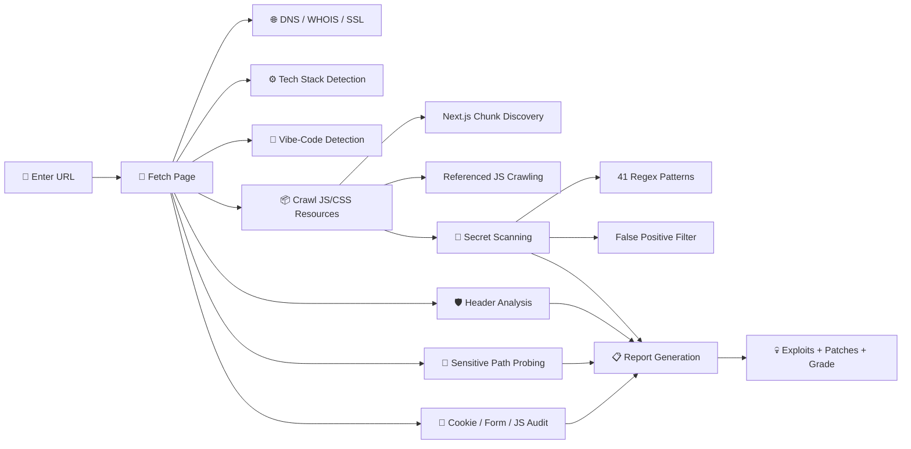

<p align="center">
  
  
  
  
</p>

<br>

<div align="center">

```
   ▄████████    ▄████████  ▄████████    ▄████████ ███    █▄  ████████▄   ▄█      ███
  ███    ███   ███    ███ ███    ███   ███    ███ ███    ███ ███   ▀███ ███  ▀█████████▄
  ███    █▀    ███    █▀  ███    █▀    ███    ███ ███    ███ ███    ███ ███▌    ▀███▀▀██
  ███         ▄███▄▄▄     ███          ███    ███ ███    ███ ███    ███ ███▌     ███   ▀
▀███████████ ▀▀███▀▀▀     ███        ▀███████████ ███    ███ ███    ███ ███▌     ███
         ███   ███    █▄  ███    █▄    ███    ███ ███    ███ ███    ███ ███      ███
   ▄█    ███   ███    ███ ███    ███   ███    ███ ███    ███ ███   ▄███ ███      ███
 ▄████████▀    ██████████  ████████▀   ███    █▀  ████████▀  ████████▀  █▀      ▄████▀
```

### ☠️ Web Security Audit Tool

**The all-in-one security scanner built for the vibe-coding era.**<br>
Scans HTML, CSS, JavaScript bundles & server configs to find hardcoded secrets,<br>
misconfigurations, and vulnerabilities — then tells you exactly how to exploit & patch them.

<br>

[Features](#-features) · [Quick Start](#-quick-start) · [Detected Secrets](#-detected-secrets) · [Vibe-Code Detection](#-vibe-code-detection) · [How It Works](#-how-it-works) · [Disclaimer](#%EF%B8%8F-disclaimer)

</div>

---

<br>

## ⚡ Features

<table>
<tr>
<td width="50%">

### 🔍 Deep Source Analysis
- Crawls **all HTML, CSS, JS** files
- **Next.js deep crawl** — discovers `_buildManifest.js`, fetches all page chunks automatically
- **OSINT Wayback Hunting** — Queries the Internet Archive to find historical secrets that were leaked in the past but removed from the live site
- **Nuclei Engine Integration** — Automatically orchestrates Nuclei (if installed) to find CVEs, exposed `.env` files, and backend misconfigurations
- **API & GraphQL Discovery** — Actively probes for hidden Swagger files and exposed GraphQL endpoints. Automatically detects unauthenticated APIs and unprotected introspection queries.
- Scans inline scripts, external bundles, stylesheets
- Concurrent fetching for speed

</td>
<td width="50%">

### 🔑 Secret Scanner (41 patterns)
- **AWS, GCP, Azure** access keys
- **Stripe, PayPal, Square** payment keys
- **OpenAI, Anthropic, OpenRouter** LLM keys
- **GitHub, GitLab, Slack, Discord** tokens
- Firebase, Supabase, Twilio, SendGrid, Mapbox...
- Smart **false-positive filtering** (skips CSS tokens, SRI hashes, etc.)

</td>
</tr>
<tr>
<td width="50%">

### 🤖 Vibe-Code Detection (25 tools)
- **AI IDEs:** Replit, Cursor, Windsurf, Copilot, Devin
- **AI Builders:** Lovable, Bolt.new, v0.dev, Create.xyz, Tempo
- **No-Code:** Bubble, Webflow, Framer, Wix, Softr, Glide, FlutterFlow
- **Deploy:** Vercel, Netlify, Railway, Render
- Risk assessment specific to each platform

</td>
<td width="50%">

### 🛡️ Security Audit
- **7 security headers** check (HSTS, CSP, X-Frame-Options...)
- **60+ sensitive paths** probed concurrently (`.env`, `.git`, `package.json`...)
- **SSL/TLS** certificate analysis
- **Cookie** security flags (Secure, HttpOnly, SameSite)
- **Form** CSRF token detection
- **JS patterns:** `eval()`, `innerHTML`, XSS sinks, API endpoints

</td>
</tr>
<tr>
<td width="50%">

### 🌐 Intelligence Gathering
- DNS records (A, AAAA, MX, NS, TXT)
- WHOIS data (registrar, creation date, org)
- IP resolution
- Technology stack fingerprinting (30+ techs)
- HTTP header analysis & info leak detection

</td>
<td width="50%">

### 💀 Actionable Exploits
Every finding includes:
- **Step-by-step exploit** with real `curl` commands
- **Copy-paste ready** attack examples
- **Detailed patch** instructions with dashboard links
- **Severity grading** from CRITICAL to INFO
- **Final security grade** (A+ to F)

</td>
<td width="50%">

### 🤖 AI Penetration Tester (Bonus)
- **OpenRouter AI integration** — After the scan, AI generates detailed exploitation steps
- Custom prompt system specialized in pentesting and red team tactics
- Real attack commands, payloads, escalation paths
- Works with any OpenRouter-compatible model (DeepSeek, GPT, Claude...)

</td>
</tr>
</table>

<br>

## 🚀 Quick Start

### Option 1: Global Installation (Recommended)
Install SecAudit globally so you can run it from anywhere in your terminal just by typing `secaudit`.
*(Note: The install script will also automatically download and install Nuclei if it's not already on your system!)*

```bash
# Clone the repo
git clone https://github.com/Seka35/secaudit.git
cd secaudit

# Run the install script
chmod +x install.sh
./install.sh

# Run from anywhere
secaudit
```

### Option 2: Run Locally
If you prefer not to install globally, you can run it directly:

```bash
git clone https://github.com/Seka35/secaudit.git
cd secaudit
python3 -m venv venv
source venv/bin/activate
pip install -r requirements.txt
python3 secaudit.py
```

> **Enter any URL** when prompted — the scanner handles the rest.

<br>

## 🔑 Detected Secrets

<details>
<summary><b>Full list of 41 secret patterns (click to expand)</b></summary>
<br>

| Provider | Secret Type | Severity |
|:---|:---|:---:|
| **AWS** | Access Key (`AKIA...`) | 🔴 CRITICAL |
| **AWS** | Secret Access Key | 🔴 CRITICAL |
| **Stripe** | Live Secret Key (`sk_live_...`) | 🔴 CRITICAL |
| **Stripe** | Publishable Key (`pk_live_...`) | 🟡 MEDIUM |
| **Stripe** | Test Secret Key (`sk_test_...`) | 🟡 MEDIUM |
| **OpenAI** | API Key (`sk-...`) | 🔴 CRITICAL |
| **Anthropic** | API Key (`sk-ant-...`) | 🔴 CRITICAL |
| **OpenRouter** | API Key (`sk-or-v1-...`) | 🔴 CRITICAL |
| **Google** | API Key (`AIza...`) | 🟠 HIGH |
| **Google** | OAuth Token (`ya29.`) | 🟠 HIGH |
| **GitHub** | Personal Access Token (`ghp_`, `ghs_`...) | 🟠 HIGH |
| **GitHub** | OAuth Token (`gho_`) | 🟠 HIGH |
| **GitLab** | Personal Access Token | 🟡 MEDIUM |
| **Slack** | Bot/User Token (`xoxb-`, `xoxp-`) | 🟠 HIGH |
| **Slack** | Webhook URL | 🟡 MEDIUM |
| **Discord** | Webhook URL | 🟡 MEDIUM |
| **Discord** | Bot Token | 🟠 HIGH |
| **Firebase** | Database URL | 🟡 MEDIUM |
| **Firebase** | API Key (with context) | 🟠 HIGH |
| **Supabase** | JWT Key | 🟠 HIGH |
| **Twilio** | API Key (`SK...`) | 🟡 MEDIUM |
| **Twilio** | Account SID (`AC...`) | 🟡 MEDIUM |
| **SendGrid** | API Key (`SG.`) | 🟠 HIGH |
| **Mailgun** | API Key (`key-`) | 🟡 MEDIUM |
| **Heroku** | API Key (with context) | 🟡 MEDIUM |
| **Shopify** | Admin API Token | 🟡 MEDIUM |
| **Cloudflare** | API Token | 🟡 MEDIUM |
| **DigitalOcean** | Token (`dop_v1_`) | 🟡 MEDIUM |
| **Mapbox** | Access Token (`pk.eyJ`) | 🟡 MEDIUM |
| **Square** | Access Token | 🟡 MEDIUM |
| **PayPal** | Client ID | 🟡 MEDIUM |
| **Vercel** | Token/Key | 🟡 MEDIUM |
| **Netlify** | Token/Key | 🟡 MEDIUM |
| — | JWT Token (`eyJ...`) | 🟠 HIGH |
| — | RSA Private Key | 🔴 CRITICAL |
| — | SSH Private Key | 🔴 CRITICAL |
| — | PGP Private Key | 🟠 HIGH |
| — | Database URL (`postgres://`, `mongodb://`...) | 🔴 CRITICAL |
| — | Generic Secret (`api_key=`, `password=`...) | 🔴 CRITICAL |
| — | Private IP Address | 🟡 MEDIUM |
| — | Base64 Encoded Secret | 🟡 MEDIUM |

</details>

<br>

## 🤖 Vibe-Code Detection

SecAudit automatically detects if a site was built with AI-assisted or no-code tools — and flags the **specific security risks** associated with each platform.

| Category | Tools Detected |
|:---|:---|
| **AI Coding IDEs** | Replit · Cursor · Windsurf (Codeium) · GitHub Copilot · Devin |
| **AI App Builders** | Lovable (GPT Engineer) · Bolt.new · v0.dev · Create.xyz · Tempo Labs · Firebase Studio |
| **No-Code / Low-Code** | Bubble.io · Webflow · Framer · Wix · Squarespace · Softr · Glide · FlutterFlow · Retool |
| **AI Frameworks** | Vercel AI SDK · Supabase + AI |
| **Deploy Platforms** | Netlify · Railway · Render |

When detected, SecAudit displays a **🚨 VIBE-CODE ALERT** with:
- The tool name and evidence found in the source code
- Platform-specific security risks (e.g., *"Lovable apps often ship with exposed Supabase keys"*)
- Targeted remediation steps

<br>

## 🔬 How It Works



<br>

## 🖥️ Output Examples

Here is a glimpse of what the **Live Stream Mode** report looks like in the terminal:

### Vibe-Code Alert
```text
╭───────────────────────────────────────────────────────────── 🤖 ─────────────────────────────────────────────────────────────╮
│ 🚨 VIBE-CODE ALERT: Lovable (GPT Engineer) Detected!                                                                       │
│                                                                                                                            │
│ Evidence: Found lovable specific classes/IDs in HTML                                                                       │
│                                                                                                                            │
│ Exploit: Apps built with Lovable often connect to Supabase. Check the JS bundles for exposed SUPABASE_KEY                  │
│ and SUPABASE_URL. If RLS (Row Level Security) is not configured, the entire database can be dumped.                        │
│                                                                                                                            │
│ Patch: Ensure Row Level Security (RLS) is strictly enforced on all Supabase tables.                                        │
╰────────────────────────────────────────────────────────────────────────────────────────────────────────────────────────────╯
```

### API & GraphQL Discovery
```text
╭─────────────────────────────────────────────────────── 🔌 ────────────────────────────────────────────────────────────────╮
│ 🔴 CRITICAL GraphQL Introspection                                                                                           │
│                                                                                                                             │
│ URL: https://example.com/api/graphql                                                                                        │
│                                                                                                                             │
│ Description / Exploit:                                                                                                      │
│ GraphQL Introspection is ENABLED! The entire database schema can be dumped.                                                 │
│ Exploit: curl -X POST https://example.com/api/graphql -H 'Content-Type: application/json' -d '{"query":"{__schema{types{n…  │
╰─────────────────────────────────────────────────────────────────────────────────────────────────────────────────────────────╯
```

### Final Score
```text
╭─────────────────────────────────────────────────── FINAL SCORE ────────────────────────────────────────────────────────────╮
│                                                                                                                            │
│   [bold white on red]  SECURITY GRADE: F  [/bold white on red]                                                              │
│                                                                                                                            │
│ Total findings: 12                                                                                                         │
╰────────────────────────────────────────────────────────────────────────────────────────────────────────────────────────────╯
```

<br>

## 📁 Project Structure

```
security-analyse/
├── secaudit.py              # Entry point — run this
├── requirements.txt         # Python dependencies
├── README.md
└── core/
    ├── __init__.py
    ├── ai_analyzer.py      # OpenRouter AI penetration tester
    ├── banner.py           # ASCII art & UI elements
    ├── patterns.py         # 41 secret patterns, 7 headers, 60+ paths,
    │                        #   30+ tech signatures, 25 vibe-coding tools
    ├── scanner.py          # 13 scan modules (DNS, SSL, secrets, JS, etc.)
    └── reporter.py          # Rich terminal report with exploit/patch details
```

<br>

## 🧪 Example Output

Each secret found produces a detailed, actionable report:

```
╭──── 🔴 CRITICAL Secret Exposed: Google API Key ────╮
│ Type:     Google API Key                            │
│ Value:    AIzaSyAwEy06...EKVKXk                     │
│ Location: /_next/static/chunks/pages/_app-e9f.js    │
│                                                     │
│ ━━━ EXPLOIT ━━━                                     │
│ 1. Test which Google APIs are enabled:              │
│    curl 'https://maps.googleapis.com/maps/api/      │
│      geocode/json?address=Paris&key=<KEY>'          │
│ 2. Check billing: unrestricted keys can rack up     │
│    charges on Maps, Translate, Vision, YouTube APIs  │
│ 3. If Firebase key: test Firestore/RTDB access      │
│                                                     │
│ ━━━ PATCH ━━━                                       │
│ 1. Go to Google Cloud Console → Credentials         │
│ 2. Add HTTP referrer restrictions (your domain)     │
│ 3. Add API restrictions (only needed APIs)          │
│ 4. Rotate the key after restricting                 │
╰─────────────────────────────────────────────────────╯
```

<br>

## 📦 Dependencies

| Package | Purpose |
|:---|:---|
| `requests` | HTTP client for fetching pages and APIs |
| `beautifulsoup4` | HTML/CSS parsing and DOM traversal |
| `rich` | Beautiful terminal output with panels, tables, colors |
| `dnspython` | DNS record resolution |
| `python-whois` | WHOIS domain information |

<br>

## ⚠️ Disclaimer

> **This tool is for authorized security testing only.**
>
> Only scan websites you own or have **explicit written permission** to test.
> Unauthorized scanning may violate computer fraud and abuse laws in your jurisdiction.
> The authors are not responsible for any misuse of this tool.

<br>

## 📄 License

MIT — See [LICENSE](LICENSE) for details.

<br>

---

<p align="center">
  <b>Built for the vibe-coding generation.</b><br>
  <sub>If you ship with AI, audit with AI. ☠️</sub>
</p>
